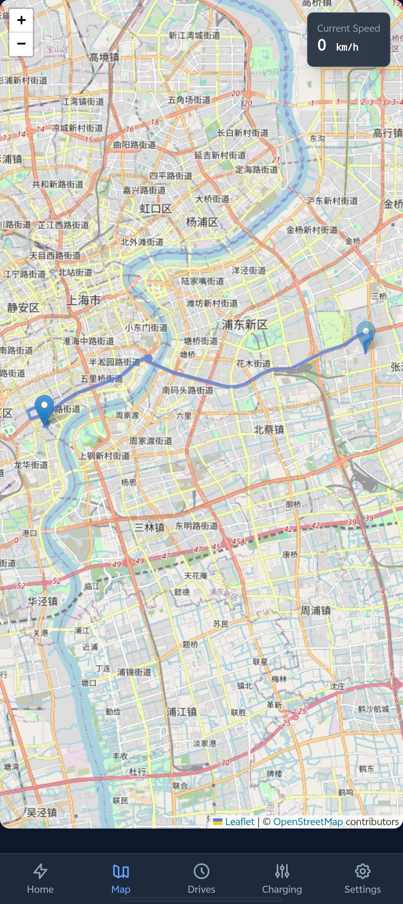
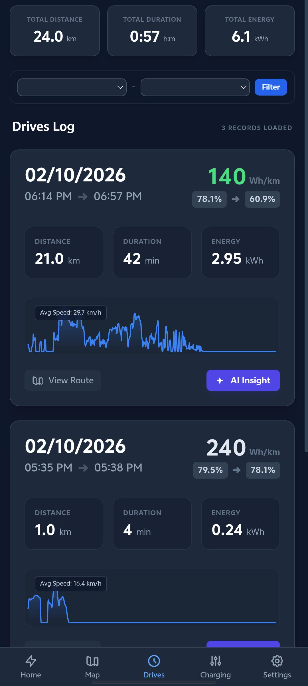
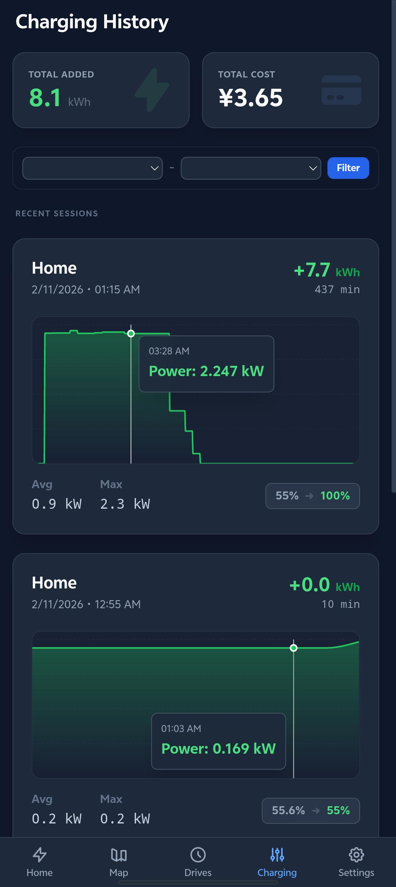
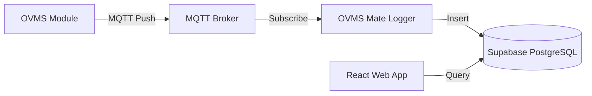

# OVMS Mate

<div align="center">

<!-- You can replace this SVG with a hosted image later, but this serves as a placeholder -->


<br/>


**A modern, TeslaMate-inspired monitoring dashboard for Open Vehicle Monitoring System (OVMS).**

[Live Demo / Website](https://ovmsmate.com) | [Report Bug](https://github.com/dicsonpan/OVMS-Mate/issues)

</div>

---

## 📖 Introduction

**OVMS Mate** is a self-hosted (or cloud-hosted) visualization dashboard designed for EV owners using the [OVMS](https://www.openvehicles.com/) hardware.

While the official OVMS App is great for control, **OVMS Mate** focuses on **beautiful data visualization**, **historical analysis**, and **efficiency tracking**. It draws heavy inspiration from the famous [TeslaMate](https://github.com/teslamate-org/teslamate) project but is built for the open ecosystem of OVMS.

It is specifically optimized for the **BMW i3** (using specific PIDs/Metrics) but can be easily adapted for other OVMS-supported vehicles.

## ✨ Key Features

*   **TeslaMate-inspired UI**: A clean, dark-mode interface that looks great on mobile and desktop.
*   **Passive Logging**: The logger subscribes silently to MQTT topics (`v.b.*`, `v.p.*`, etc.) without waking the car unnecessarily. It captures data only when the car pushes updates.
*   **Drive Recording**: Automatically logs trips with detailed stats:
    *   Efficiency (Wh/km)
    *   Elevation & Speed Charts
    *   Total Consumption
    *   GPS Path on Map
*   **Charging Analytics**: detailed charging sessions with power curves (kW), SoC gain, and cost calculations.
*   **Real-time Dashboard**: Live status of SoC, Range, Speed, Power, and Battery/Motor temperatures.
*   **AI Insights (Experimental)**: Integrated **Google Gemini AI** to analyze your drive efficiency and provide driving tips.

## 📸 Screenshots

<div align="center">
  <h3>Real-time Dashboard & Live Map</h3>
  
  
</div>

<br/>

<div align="center">
  <h3>Drive History & Charging Analytics</h3>
  
  
</div>

## 🏗 Architecture

OVMS Mate modernizes the stack by separating data ingestion from visualization:

1.  **Logger (Node.js)**: A lightweight Docker container. It connects to your OVMS MQTT broker, listens for metrics, detects state changes (Driving/Charging), and pushes clean data to the database.
2.  **Database (Supabase)**: A PostgreSQL database that stores all telemetry, drives, and charging sessions.
3.  **Frontend (React/Vite)**: A responsive web application (hosted on Vercel, Netlify, or locally) that visualizes the data.



## 🚀 Getting Started

### Prerequisites

1.  **OVMS Module**: Installed and running in your vehicle.
2.  **Supabase Account**: Create a free project at [supabase.com](https://supabase.com).
3.  **Docker Environment**: A VPS, NAS (Synology/QNAP), or Raspberry Pi to run the logger.

### Step 1: Database Setup

1.  Go to your Supabase Project -> **SQL Editor**.
2.  Copy the content of `supabase_schema.sql` from this repository and run it. This creates the necessary tables (`telemetry`, `drives`, `charges`).

### Step 2: Configuration

Create a `.env` file in the root directory (copy from `.env.example`):

```bash
cp .env.example .env
```

Edit `.env` with your credentials:

```ini
# OVMS MQTT Credentials
OVMS_ID=YourVehicleID
OVMS_USER=YourVehicleID
OVMS_PASS=YourSecretPassword
OVMS_SERVER=dexters-web.de (or your broker IP)

# Supabase Credentials (Found in Project Settings -> API)
VITE_SUPABASE_URL=https://your-project.supabase.co
VITE_SUPABASE_ANON_KEY=your-supabase-anon-key-starts-with-ey...

# Optional: Google Gemini API for AI Analysis
API_KEY=AIzaSy...
```

### Step 3: Run the Logger (Docker)

The logger needs to run continuously to collect data.

```bash
docker-compose up -d --build
```

### Step 4: Run the Frontend

You can deploy the frontend to **Vercel** (recommended for free SSL/hosting) or run it locally.

**Local Development:**
```bash
npm install
npm run dev
```

**Vercel Deployment:**
1.  Push your code to GitHub.
2.  Import project into Vercel.
3.  Add `VITE_SUPABASE_URL`, `VITE_SUPABASE_ANON_KEY`, and `API_KEY` to Vercel Environment Variables.

## ☕ Support the Project

This project is free and open-source. If you find it useful for monitoring your EV, consider buying me a coffee! It helps keep the updates coming.

<a href="https://www.paypal.com/paypalme/dicsonpan" target="_blank">
  
</a>

**PayPal**: dicsonpan@gmail.com

## 🤝 Contributing

Contributions are welcome! Please feel free to submit a Pull Request.

## 📄 License

Distributed under the MIT License.