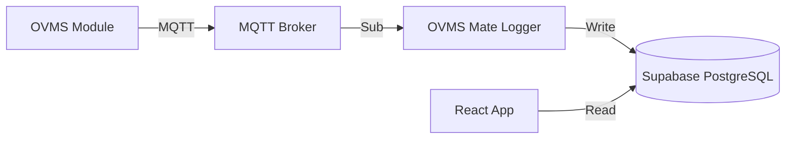

# OVMS Mate

<div align="center">


**A modern, TeslaMate-inspired monitoring dashboard for Open Vehicle Monitoring System (OVMS).**

[Live Demo / Website](https://ovmsmate.com) | [Report Bug](https://github.com/dicsonpan/OVMS-Mate/issues)

</div>

---

## 📖 Introduction

**OVMS Mate** is a self-hosted (or cloud-hosted) visualization dashboard designed for EV owners using the [OVMS](https://www.openvehicles.com/) hardware.

Inspired by the clean and data-rich interface of [TeslaMate](https://github.com/teslamate-org/teslamate), this project aims to bring that same high-quality experience to non-Tesla vehicles (specifically optimized for **BMW i3**, but adaptable to others).

Unlike the standard OVMS App, OVMS Mate focuses on **historical data visualization**, **efficiency analysis**, and **beautiful real-time dashboards**.

## ✨ Features

*   **Real-time Dashboard**: Live status of SoC, Range, Speed, Power, and Battery/Motor temperatures.
*   **Drive Logging**: Automatically records trips with efficiency metrics (Wh/km), elevation, and speed charts.
*   **Charging History**: detailed charging sessions with power curves and cost calculations.
*   **Live Map**: Real-time tracking with trajectory lines (TeslaMate style).
*   **AI Insights**: Integrated **Google Gemini AI** to analyze your drive efficiency and provide tips.
*   **Passive Logging**: Listens silently to MQTT traffic without waking the car unnecessarily.
*   **Mobile Friendly**: Fully responsive design for phone, tablet, and desktop.

## 🏗 Architecture

OVMS Mate consists of three main components:

1.  **Backend Logger (Node.js)**: A lightweight Docker container that subscribes to your OVMS MQTT broker. It listens for metrics, detects state changes (Driving/Charging), and writes data to the database.
2.  **Database (Supabase)**: A PostgreSQL database that stores all telemetry, drives, and charging sessions.
3.  **Frontend (React)**: A modern web application (hosted on Vercel or locally) that visualizes the data.



## 🚀 Getting Started

### Prerequisites

1.  **OVMS Module**: Installed and running in your vehicle.
2.  **Supabase Account**: Create a free project at [supabase.com](https://supabase.com).
3.  **Docker Environment**: A VPS, NAS (Synology/QNAP), or Raspberry Pi to run the logger.

### Step 1: Database Setup

1.  Go to your Supabase Project -> **SQL Editor**.
2.  Copy the content of `supabase_schema.sql` from this repository and run it. This creates the necessary tables (`telemetry`, `drives`, `charges`).

### Step 2: Configuration

Create a `.env` file in the root directory (copy from `.env.example`):

```bash
cp .env.example .env
```

Edit `.env` with your credentials:

```ini
# OVMS MQTT Credentials
OVMS_ID=YourVehicleID
OVMS_USER=YourVehicleID
OVMS_PASS=YourSecretPassword
OVMS_SERVER=dexters-web.de (or your broker IP)

# Supabase Credentials (Found in Project Settings -> API)
VITE_SUPABASE_URL=https://your-project.supabase.co
VITE_SUPABASE_ANON_KEY=your-anon-key...

# Optional: Google Gemini API for AI Analysis
API_KEY=AIzaSy...
```

### Step 3: Run the Logger (Docker)

The logger needs to run continuously to collect data.

```bash
docker-compose up -d --build
```

### Step 4: Run the Frontend

You can deploy the frontend to **Vercel** (recommended) or run it locally.

**Local Development:**
```bash
npm install
npm run dev
```

**Vercel Deployment:**
1.  Push your code to GitHub.
2.  Import project into Vercel.
3.  Add `VITE_SUPABASE_URL`, `VITE_SUPABASE_ANON_KEY`, and `API_KEY` to Vercel Environment Variables.

## ☕ Support the Project

If you find OVMS Mate useful and want to support its development, you can buy me a coffee!

*   **PayPal**: [dicsonpan@gmail.com](https://www.paypal.com/myaccount/transfer/homepage)

## 🤝 Contributing

Contributions are welcome! Please feel free to submit a Pull Request.

1.  Fork the Project
2.  Create your Feature Branch (`git checkout -b feature/AmazingFeature`)
3.  Commit your Changes (`git commit -m 'Add some AmazingFeature'`)
4.  Push to the Branch (`git push origin feature/AmazingFeature`)
5.  Open a Pull Request

## 📄 License

Distributed under the MIT License.
